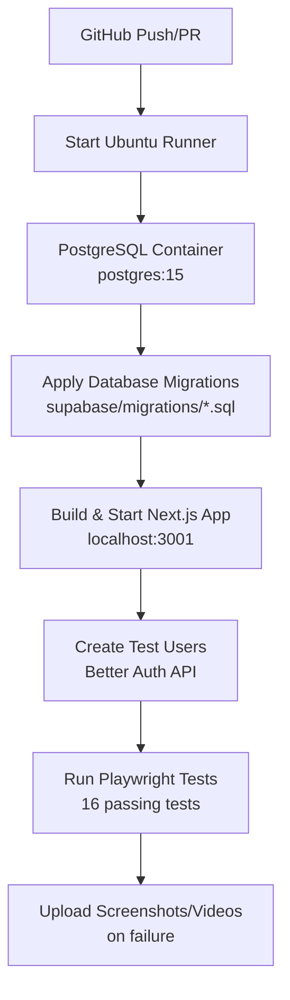

# GitHub Actions CI Setup Guide

## 🚀 Quick Setup Checklist

Your CI is **almost ready**! Here's what you need to do:

### 1. Set GitHub Repository Secret (REQUIRED)

```bash
# Generate a secure secret
openssl rand -hex 32
```

Then add it to GitHub:
1. Go to your repo → **Settings** → **Secrets and variables** → **Actions**
2. Click **"New repository secret"**
3. Name: `BETTER_AUTH_SECRET`
4. Value: [paste the generated 64-character hex string]
5. Click **"Add secret"**

### 2. Test the CI Pipeline

The CI will automatically run on:
- ✅ Push to `main` branch
- ✅ Pull requests to `main` branch
- ✅ Push to `fix/playwright-ci-tests` branch (for testing)

## 🏗️ How CI Works



### Test Database Strategy

- ✅ **PostgreSQL 15** service container (Docker-based)
- ✅ **Automatic migrations** from `supabase/migrations/`
- ✅ **Better Auth compatible** test user creation
- ✅ **Isolated per run** - fresh database every time

### Current Test Status

- ✅ **16 passing tests** (Authentication + Dashboard)
- ❌ **4 failing tests** (Calendar integration - optional)
- 🔄 **Single worker** in CI for stability
- 🔄 **2 retries** on failure
- 📊 **GitHub Actions reporter** with screenshots

## 🛠️ What We Fixed

1. **Database Strategy**: Uses PostgreSQL service container instead of external DB
2. **User Creation**: Better Auth API calls instead of direct database insertion
3. **App Lifecycle**: Build → Start → Test → Stop
4. **Test Isolation**: Single worker to prevent authentication conflicts
5. **Error Reporting**: Screenshots/videos uploaded on test failures

## 🔧 Troubleshooting

If CI fails, check:

1. **BETTER_AUTH_SECRET is set** in GitHub repository secrets
2. **Database migrations** are valid SQL files
3. **App health endpoint** responds at `/api/health`
4. **Test users** can be created via Better Auth

The CI logs will show exactly where it fails with detailed output.

## 📈 Next Steps (Optional)

- Fix 4 calendar integration tests (currently optional)
- Add more test coverage
- Set up deployment workflows
- Add performance testing